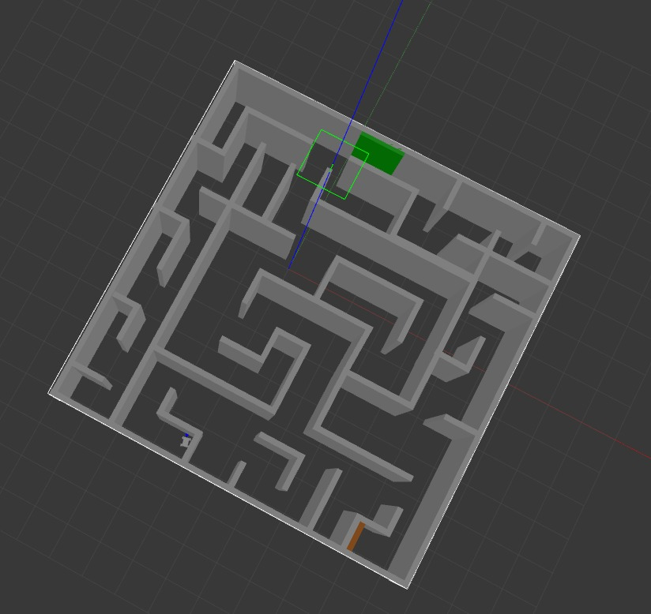
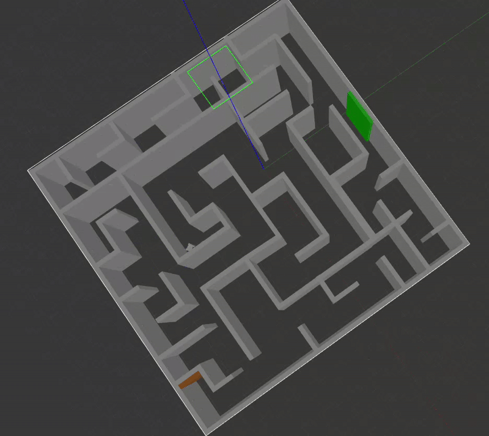
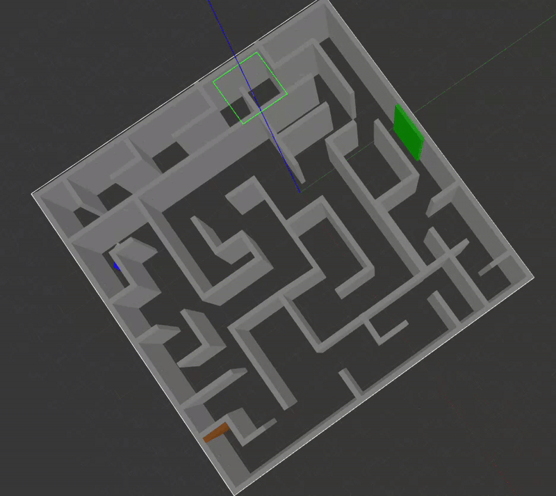

# Maze Pathfinding in ROS2

## The algorithm
Set robot in an angle
On reaching a distance eps on the wall rotate randomly in given range and move forward

## proof of convergence
Since the state of the robot in the maze is a markov chain and that the maze if a strongly connected graph then we have theorem that all states can be visited
### Theorem (Ergodic Theorem for Markov Chains)

If a Markov chain is:
1. **Irreducible**: Every state can be reached from any other state.
2. **Aperiodic**: The system doesn't get stuck in cycles.

Then the chain is **ergodic**, meaning:
- Starting from any state, the chain will eventually visit all states with non-zero probability.
- This guarantees that all states in the maze will be visited by the robot over time.

Since the maze is a strongly connected graph, the robot's movement is likely both irreducible and aperiodic, ensuring it will eventually visit all reachable states.

But it may take a long time (assuming the robot does not get stuck due to physical structure of the robot)


## Setup Instructions

1. Install ROS2 and set up a workspace.
2. Unzip zip file mazerover-auto.zip
3. Build the package:
   ```bash
   colcon build
   ```
4. Source the workspace:
   ```bash
   source install/setup.bash
   ```
5. Run the node
6. Dont forget to run auto.cpp
   ```
   ros2 run haruto_description auto
   ```
   as well as
   ```
   ros2 launch haruto_description visualize_robot_simulation.launch.py
   ```

## Image


## One of the Runs


